# 🎯 Typing Speed Game — Master Your Typing Skills

Welcome to the first version of **Typing Speed Game**, a desktop app built in Python using `Tkinter` that helps you improve your typing accuracy, speed, and focus in a progressively challenging way.

---

## 📜 Game Summary

When you launch the game, it starts by asking for the player's **name** and **nickname**. These details are saved in a JSON file so that:
- Your nickname is used in greetings and during gameplay
- Your **score history** is tracked
- Your **best score** is recorded permanently

Upon registration, a warm welcome message using your nickname appears, followed by a **main menu screen** with 4 key buttons:

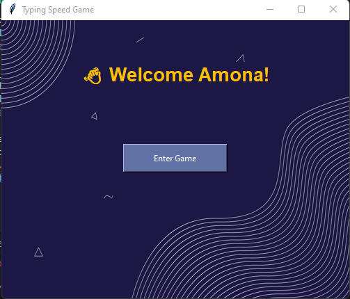


---

## 🧭 Main Menu
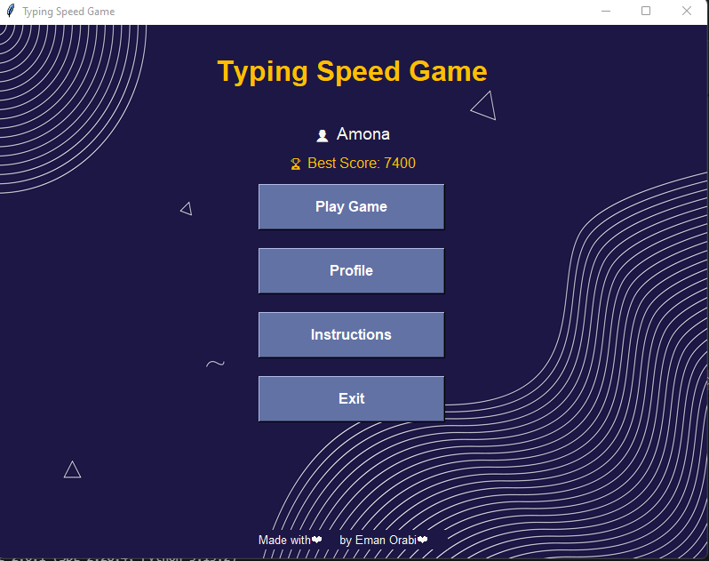

- `Play Game` → Choose your difficulty & level
- `Profile` → See your name, scores & graph
- `Instructions` → Learn how to play
- `Exit` → Close the game

---

## 🕹️ Gameplay Flow

When you click **Play Game**, you’re prompted to choose one of the following difficulties:

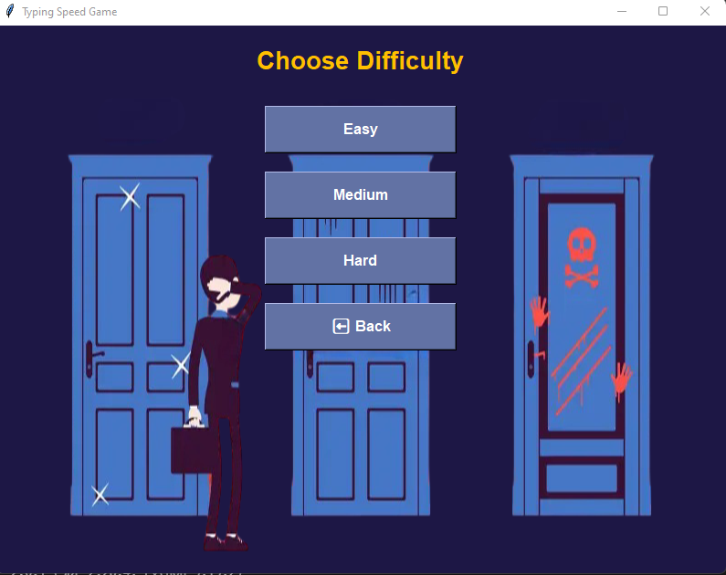

### 🔹 Easy — 100 levels  
Each level contains 50 words with 3–5 letters  
🕐 Total time per level: 120 seconds

### 🔸 Medium — 100 levels  
Each level contains 50 words with 6–8 letters  
🕐 Total time: 150 seconds

### 🔴 Hard — 100 levels  
Each level contains 50 words with 9+ letters  
🕐 Total time: 180 seconds  
⏱️ **Bonus:** At level 40+, each level gets an extra 30s!

Levels are loaded from files:
- `levels/easy.json`
- `levels/medium.json`
- `levels/hard.json`

These files are **auto-generated** from a clean English dictionary (via `nltk.corpus.words`) without repetitions.

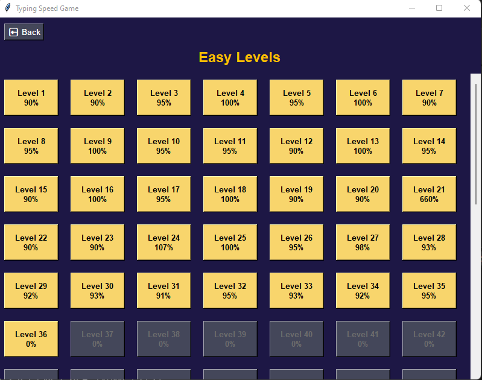

And here is how the level is in the game
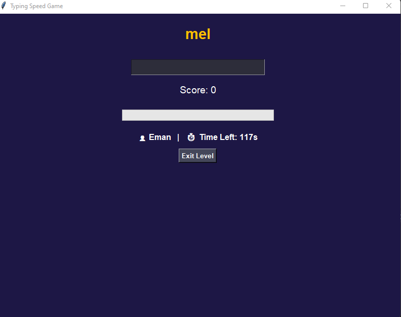

And here is how the progress bar changes after a correct answer.
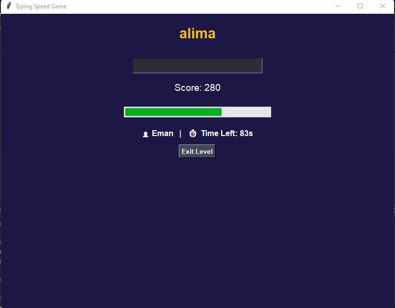


---

## ✅ Unlocking Levels

By default, all levels are locked except the first one.  
To unlock the next level, you must:
- Achieve **90% accuracy or more**

You’ll hear 🎵 **a clap sound** when a correct word is typed  
You’ll hear 🚨 **an alert sound** when a word is wrong or times out

Words disappear in **10 seconds**, and a new one appears automatically. The score system updates in real-time, and you can see your accuracy through a **Progress Bar**.

At the end of each level:
- You see your accuracy %
- A message shows whether you passed or need to retry
- Options to go **Back**, **Retry**, or **Next Level** (if passed)

- And this is a Sorry Message if the player loses the level
  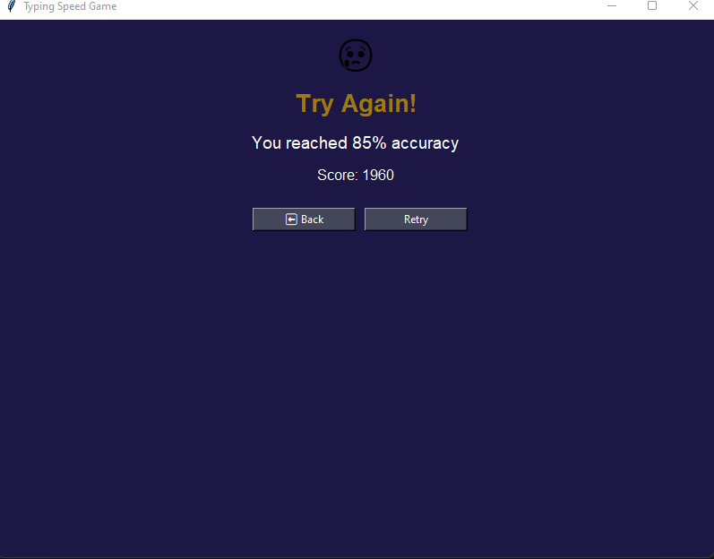
  
- And this is a Sorry Message if the player wins the level
  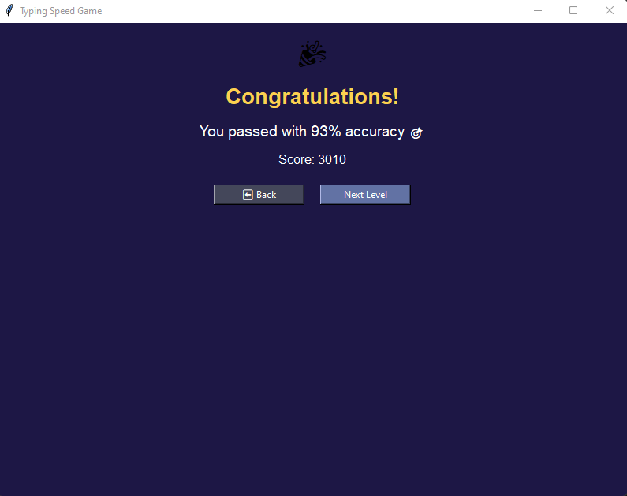


---

## 👤 Profile View

Clicking **Profile** shows:
- Your name
- Your best score ever
- Your most recent score
- A graph of your progress over time

- The Profile after Losing
  
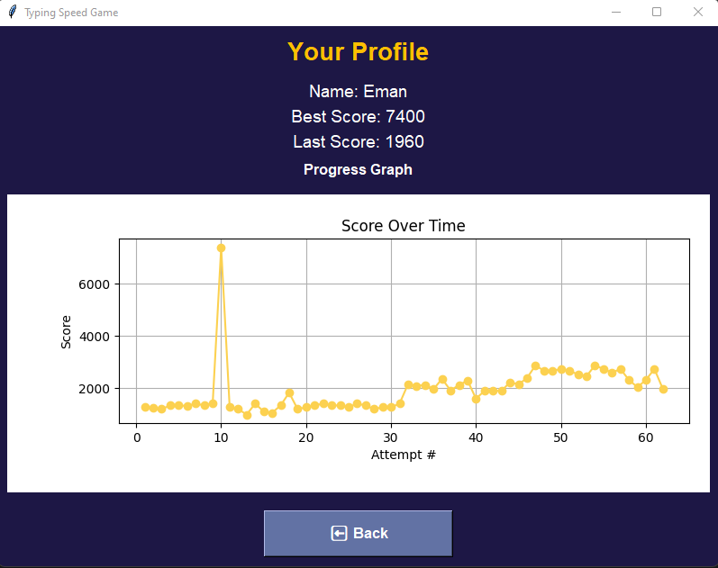

- The Profile after Winning
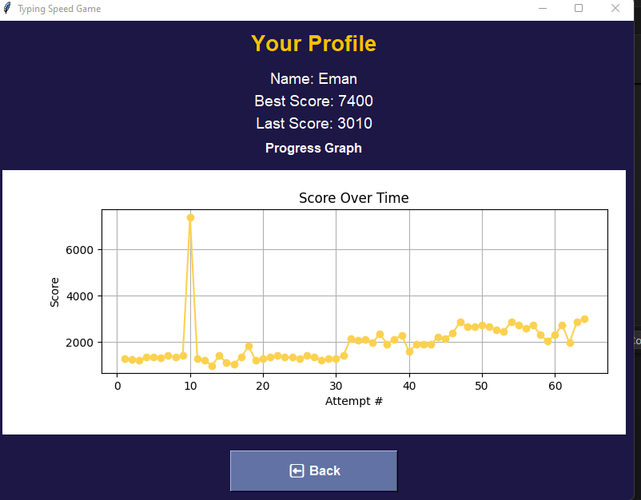

The graph is implemented with `Matplotlib` and embedded into the Tkinter interface.

---

## 📝 Instructions View

Clicking **Instructions** opens a page explaining:
- How the game works
- Controls and rules
- Scoring mechanics
- Time limits
- Bonus rules
- How to exit

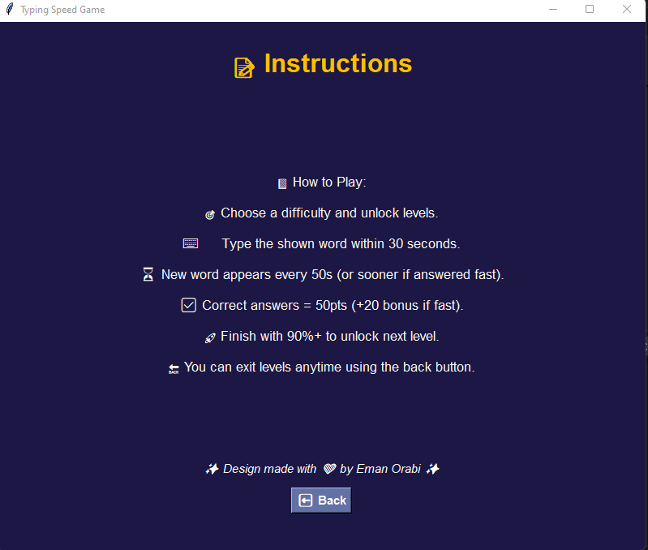

---

## 📂 Folder Structure

```
typing-speed-game/
├── assets/                 # Images and sounds
│   ├── typing_bg.png
│   ├── beep_correct.wav
│   └── beep_wrong.wav
├── data/                   # User data + progress
│   ├── user_data.json
│   └── level_status.json
├── levels/                 # Pre-generated level files
│   ├── easy.json
│   ├── medium.json
│   └── hard.json
├── main.py                 # Entry point of the game
├── game_engine.py          # Core game loop and logic
├── data_handler.py         # Handles user data/save/load
├── graph.py                # Score graph integration
├── sounds.py               # Handles sound effects
├── generate_levels.py      # Script to create level data
└── README.md               # This file
```

---

## ⚙️ Technologies Used

| Category         | Library             |
|------------------|---------------------|
| GUI              | `tkinter`           |
| Data Storage     | `json`              |
| Word Source      | `nltk.corpus.words` |
| Sound Effects    | `pygame`            |
| Charts & Graphs  | `matplotlib`        |
| Image Support    | `PIL (Pillow)`      |

---

## 📦 Installation

```bash
pip install pygame pillow matplotlib nltk
```

Download NLTK word list:

```python
import nltk
nltk.download("words")
```

Then run the game:
```bash
python main.py
```

---

## 🖥️ Executable Version (.exe)

This game has been packaged into a Windows `.exe` for offline play using:
```bash
pyinstaller --noconfirm --onefile --windowed main.py
```

You can now share it with non-developers too!

---

## 💡 Responsive Design

All screens are responsive:
- Window can be resized freely
- Clicking the maximize button adapts the layout
- Buttons and labels scale automatically
- Level buttons recenter themselves based on screen width

---

## 🔮 Future Plans

- Add **word definitions** under each word (learning + playing)
- Introduce **combo streaks** (e.g., 3+ fast answers → bonus)
- Add **animations** for passed/failed results
- Add **light mode** toggle
- Arabic translation for all UI
- Leaderboard & multiplayer support (maybe 👀)

---

## 🙌 Credits

Developed with passion by **Eman Orabi**  
👩‍💻 Computer Engineer | AI Enthusiast | Python Developer

This game was built as a personal challenge to blend technical skill with creativity, aiming to help others improve their typing speed in a fun, clean, and interactive way.

Always exploring the intersection of intelligent systems and user experience.  
Let's keep learning, building, and leveling up! 💛


